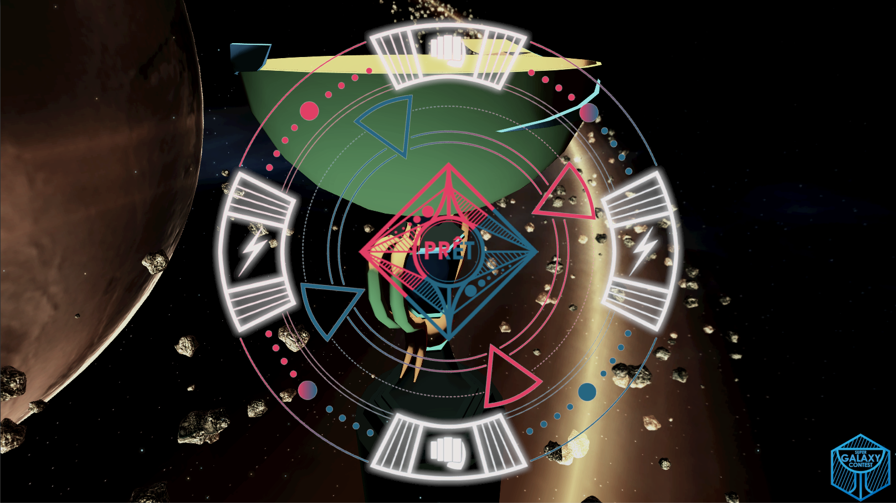
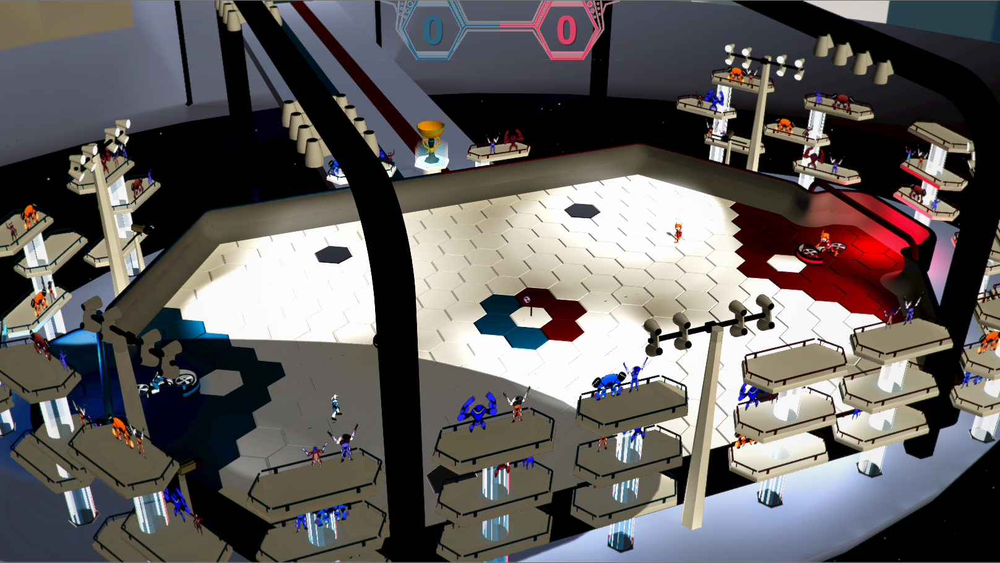
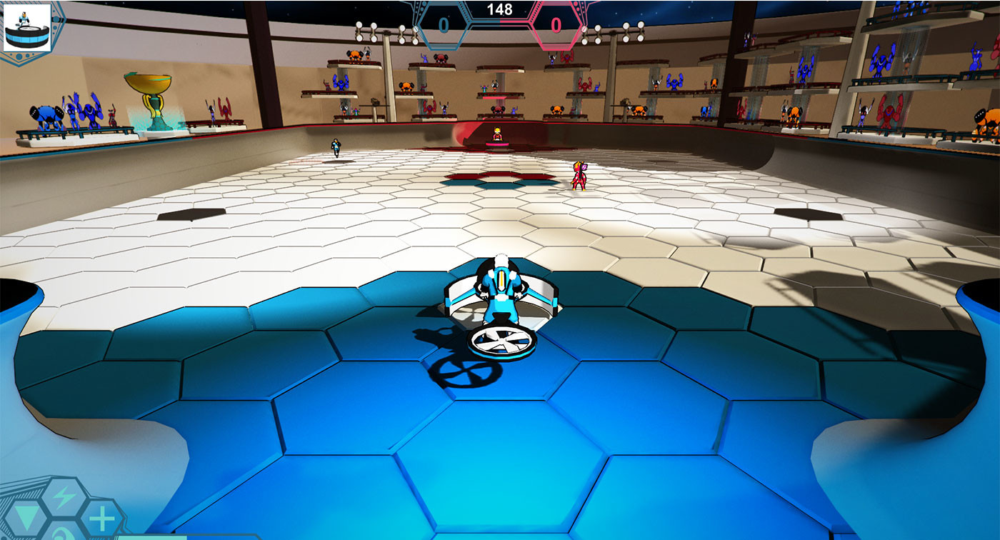
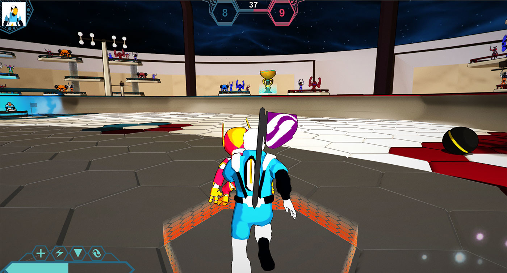

# Super Galaxy Contest

## Table of contents
[The game](#the-game)  
[Requirements](#requirements)  
[Illustrations](#illustrations)  
[Networking](#networking)  

Project realised in two weeks with Emilien Grude, Thibaud Serre, Quentin Boucher and Thomas Chantelose. I wrote all the code for this project.  
Super Galaxy Contest was made for the [Virtual Fantasy contest] (https://www.laval-virtual.org/en/prices-competitions/virtual-fantasy/presentation-vf-en.html)at Laval Virtual 2016 exhibition, and was awarded with the price of Interaction.

You can watch the [trailer on YouTube](https://www.youtube.com/watch?v=ZEY9-iThG5E).  
You can also find more artwork on [Emilien Grude's Artstation](https://www.artstation.com/artwork/RzZrv)

## The game
In short, Super Galaxy Contest is a football game played with two players in each team, with a bit of "Capture the Flag".  

Each player is the team has a unique role, a player can either be the "Snooper" or the "Roamer".
- Snoopers:
	1) Take the flag
	2) Tackle each others (to take the flag)
	3) Bring the flag to their roamers

- Roamers :
	1) Focus on the ball
	2) Defend their goal
	3) Score goals
	4) Use special abilities to improve allies or weaken ennemies for a short time
	*Roamers can only use one special ability per flag brought home by Snoopers.

- Points are received by:
	1) Scoring a goal (5 points)
	2) Bringing a flag home (1 point)

## Requirements
While Unity is required to run this game, hardware is the biggest requirement.  
You will need:
- 1 server setup:
	* 1 computer with 1 screen (the screen is spectators, use a big one or a projector !)
- 2 client setups, one for each team :
	* 1 computer with 2 screens (one for each player in the team)
	* 1 controller (with used XBox controllers)
	* 1 Novint Falcon
- A router, to setup the network

## Illustrations

- The lobby :
White marks become pink or blue (color depends on the team) when players are ready.
The "Ready" mark in the center becomes white when the current player becomes ready.

- Spectator view:

- Roamer view:

- Snooper view:

## Networking
The biggest challenge for me in this project was the networking. I just discovered UNet (with the [SuperDwarves Tavern Championship](https://github.com/Zelgunn/SuperDwarves-Tavern-Championship) project).  
There were three difficulties:  
1) Which computer has authority on the ball (computers with authority decides how the ball behaves with physics):
	* This problem was solved by giving authority to the last team that hit the ball
	* We used one computer for two players, reducing the amount of networking required
2) Make a lobby that setups itself automatically and quickly (this game was made for an exhibition):
	* Setup files were given to each computers, giving them all the informations they needed to connect
	* We used a separate router, with ethernet, to ensure reliability at the exhibition
	* We used broadcasting, to allow clients to discover the server automatically
3) Synchronizing player states:
	* We used components built-in Unity but we still had jitters sometimes, mostly on the server.
	* This includes animations, positions, state (tackling, running, traped, ...)